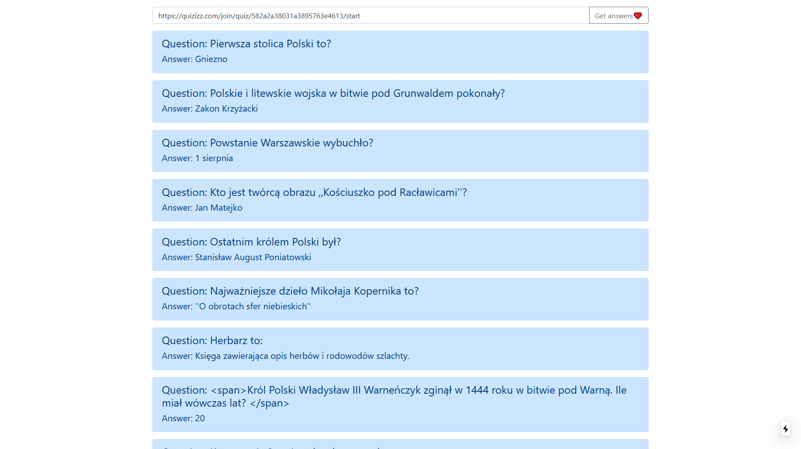

# easy-quizizz
Quizizz answers web app, written in Next.js

You can test the app [here!](https://easy-quizizz.vercel.app/)

https://quizizz.com/join/game/U2FsdGVkX1%252Bp4MkbK8rlF9Lxa1utKCga4D40LOqh%252BysKazUuGP7Geh9Mp%252Fk%252BHVzI?gameType=live


https://quizizz.com/join/game/U2FsdGVkX1%252FCAD9Qj%252FmnDNHzrwCzmAYT0gk%252FDVYW2E5pgAkWkUs6%252FHpHUPgJJ2Nx?gameType=solo


https://quizizz.com/join/quiz/d89f348cd25a6ce96ed8a9c0bb36d98fb0f88bea448a67c1485259d7755eca44/start?studentShare=true

### Disclaimer
Since Quizizz released new update app doesn't work



## Contributing

1. Fork the Project
2. Create your Feature Branch (`git checkout -b feature/AmazingFeature`)
3. Commit your Changes (`git commit -m 'Add some AmazingFeature'`)
4. Push to the Branch (`git push origin feature/AmazingFeature`)
5. Open a Pull Request

## Getting Started

First, run the development server:

```bash
npm run dev
# or
yarn dev
```

Open [http://localhost:3000](http://localhost:3000) with your browser to see the result.

## License

Distributed under the MIT License. See `LICENSE` for more information.
